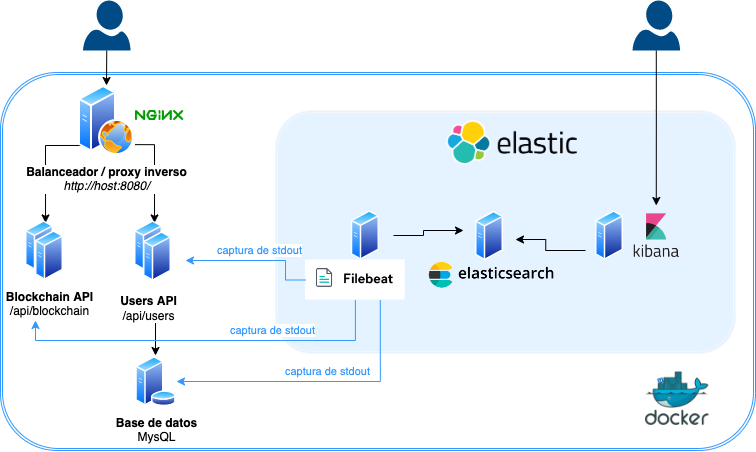
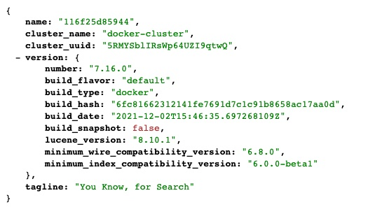
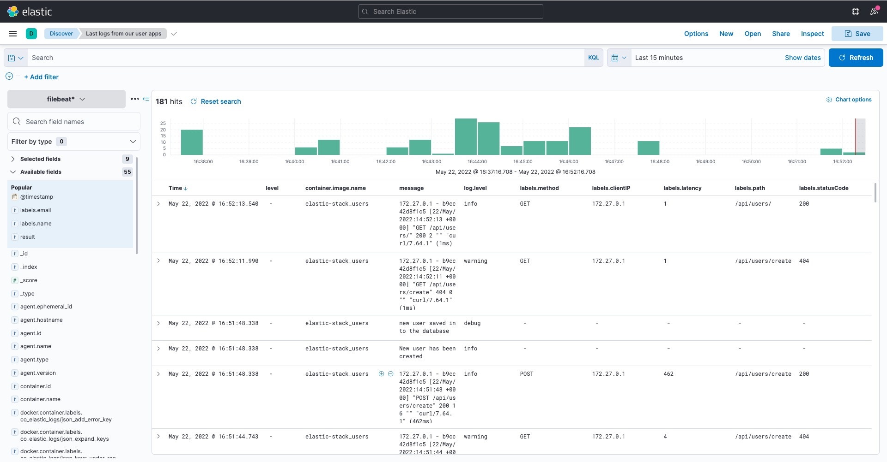

# 📶 Elastic Stack (docker) + Aplicación Java + Aplicación en Go

Este repositorio incluye **Elasticsearch**, **Kibana** y **Filebeat**. Se incluyen 2 API's:

- una desarrollada en **Java** que simula unas operaciones de verificación de una cadena de bloques (`/api/blockchain/`)
- otra desarrollada en **Go**, que simula operaciones de creación y listado de usuarios (`/api/users/`). Esta aplicación además,
  se conecta con una base de datos **MySQL**.

Se incluye además un balanceador de carga y proxy inverso **nginx** través del cual se puede acceder a las diferentes API's y
que, a modo de ejemplo, permitiría escalar los servicios arriba/abajo atendiendo a la carga asociada. Este balanceador de carga
expone sus servicios a través del puerto `8080`.



## Requisitos

Para ejecutar todos los servicios correctamente es necesario disponer de [Docker Engine](https://docs.docker.com/engine/) y
de [docker-compose](https://docs.docker.com/compose/) instalados. Una opción sencilla es
instalar [Docker Desktop](https://docs.docker.com/desktop/) que además de otros componentes incluye a éstos de serie.

## Arrancando

Una vez instalados los requisitos, puedes clonar este repositorio en tu máquina de destino:

`git clone ...`

A continuación ejecutar todos los servicios con el comando:

`docker-compose up -d`

Puedes comprobar que todos los servicios estén operativos y sanos:

`docker-compose ps`

Deberíamos obtener un resultado similar a este:

```
NAME                              COMMAND                  SERVICE             STATUS               PORTS
elasticsearch                     "/bin/tini -- /usr/l…"   elasticsearch       running (starting)   0.0.0.0:9200->9200/tcp
filebeat                          "/usr/bin/tini -- /u…"   filebeat            running
kibana                            "/bin/tini -- /usr/l…"   kibana              running (starting)   0.0.0.0:5601->5601/tcp
monitoring-elastic-blockchain-1   "jbang BlockChainSer…"   blockchain          running (starting)   80/tcp
monitoring-elastic-db-1           "docker-entrypoint.s…"   db                  running (healthy)    0.0.0.0:3306->3306/tcp
monitoring-elastic-users-1        "./main"                 users               running              80/tcp
monitoring-elastic-webproxy-1     "/app/docker-entrypo…"   webproxy            created
```

Para comprobar que Elasticsearch está operativo, puedes comprobarlo accediendo a su puerto standard (`http://localhost:9200`) con
tu navegador favorito. Deberías obtener una UI como esta:


Por otro lado y para verificar que Kibana está funcionando correctamente, puedes hacerlo accediendo a su puerto
standard (`http://localhost:9200`) con nuestro navegador. Deberías ver algo tal que:


## Accediendo a nuestras API's

Una vez todos los servicios estén activos y sanos, puedes conectar a través de las diferentes API's a través del balanceador de carga. Por ejemplo, para la aplicación de Go -que simularía un servicio de gestión de usuarios- puedes comprobar que está activa y funcionando a través de las llamadas siguientes:
```
curl http://localhost:8080/api/users/
{}
```

Esta llamada simularía una petición para obtener el conjunto de usuarios disponibles -aunque en esta ocasión, no devuelve ningún registro 😉-.

También podemos probar a realizar otra petición, que en esta ocasión creará un usuario nuevo en nuestra base de datos, accediendo además, a una API externa:
```
curl -d {} http://localhost:8080/api/users/create
{"message":"ok"}
```

Respecto a la otra API, desarrollada en Java y que emula un servicio de cálculo de una cadena de bloques (_BlockChain_), podemos comprobar que funciona, realizando las siguientes llamadas:

```
# curl -d '{ "number": {numero} }' --header 'Content-Type: application/json' http://localhost:8080/api/blockchain/

curl -d '{ "number": 5555 }' --header 'Content-Type: application/json' http://localhost:8080/api/blockchain/
52
curl -d '{ "number": 11221 }' --header 'Content-Type: application/json' http://localhost:8080/api/blockchain/
165
```
Este tipo de peticiones POST requieren incluir en la petición con un objeto JSON un número (`number`) a partir del cual se inicia el cálculo de la cadena de bloques. El servidor devolverá como respuesta devuelve el tiempo que ha tardado el servidor en procesar tal número en milisegundos. 

**Nota**: ¡presta atención al número que envíes! ¡Cuánto más grande lo envíes, más tiempo llevará al servidor procesar tal número 😅!

También podemos realizar una petición a un endpoint que actúa simulando lo que sería un resumen de la cadena de bloques:
```
curl http://localhost:8080/api/blockchain/summary
{ "requests": 4, "latency": 5829 }
```
El servidor devuelve como respuesta un objeto JSON con el contador del número de peticiones realizadas y la latencia media para tal endpoint.

Podemos escalar fácilmente nuestra aplicación aumentando o disminuyendo el número de instancias de nuestras API's:
```
docker-compose up -d --scale users=4
docker-compose up -d --scale blockchain=2
```

## Resultado final

Finalmente, una vez hemos comprobado que todas nuestras API's funcionan correctamente, deberemos pasar a configurar convenientemente Elasticsearch y Kibana. Deberíamos poder conseguir capturar y buscar información acerca de los logs de nuestras API's para obtener una visualización tal que la que se muestra a continuación:

